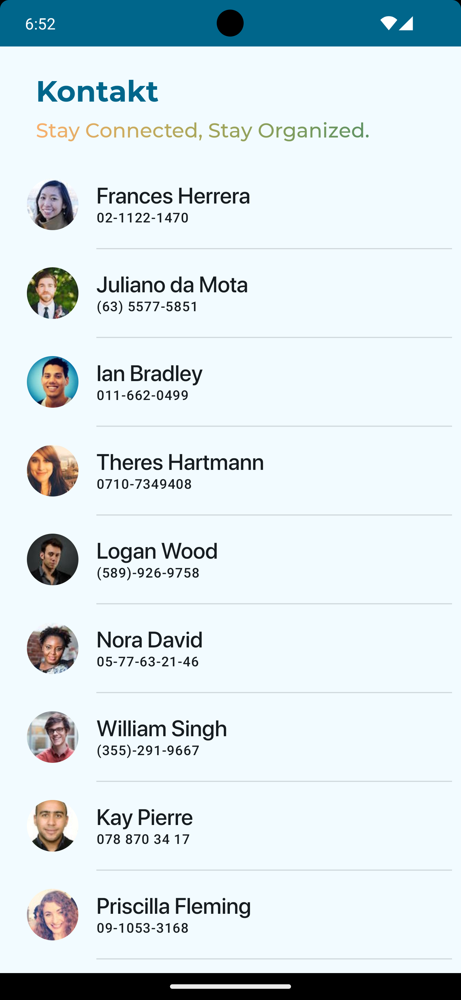
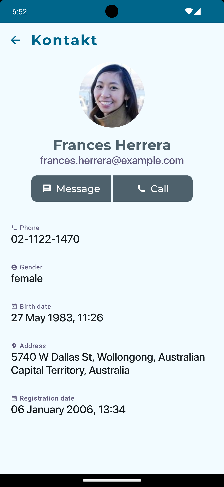

# Kontakt

[](https://www.android.com)
[](https://android-arsenal.com/api?level=28)
[](https://opensource.org/licenses/MIT)

Kontakt is a lightweight online/offline contact app built with Jetpack Compose, MVVM and Android Architecture Components.

<a name="description"></a>

## Challenge description

Create an offline Contact Android Application displaying a list of contacts and their details when
clicking on it, by using a network API.

- Load contacts from [Random User API](https://randomuser.me/).
- UI Components built with Compose
- Show contacts with the following details :
  - Firstname and lastname.
  - Phone number.
  - Birth date
  - Registration date.
  - Address.
- Refresh/Update contact in database with Room and Flow
- Handle Caching mechanism and Infinite scroll with Paging3

<a name="screenshots"></a>

## Showcase

#### Screenshots

<table style="width:100%">
  <tr>
    <th>1. Contact List</th>
    <th>2. Contact Details</th>
  </tr>
  <tr>
    <td></td>
    <td></td>
  </tr>
   </table>

#### Screen records

<table style="width:100%">
  <tr>
    <th>1. Infinite scroll</th>
    <th>2. Network Error Handling</th>
  </tr>
  <tr>
    <td><video src="https://github.com/gabriel-TheCode/Kontakt/assets/26333609/5d7f572e-26b8-4867-be2d-3409d01d0a3c"/></td>
    <td><video src="https://github.com/gabriel-TheCode/Kontakt/assets/26333609/2cc7b92d-7a88-4972-831c-908188bc7347"/></td>
  </tr>
   </table>

<a name="specifications"></a>

## Specifications

- [x] Retrieve contacts from [Random User API](https://randomuser.me/).
- [x] Caching synch between network and local database
- [x] Material Design 3
- [x] Light/Dark Theme
- [x] Handling connectivity status
- [x] MVVM/Clean Architecture
- [x] Unit tests

<a name="tools"></a>

## Languages, libraries and tools used

- [Kotlin](https://kotlinlang.org/)
- [Jetpack comopose](https://kotlinlang.org/)
- [Paging3](https://developer.android.com/topic/libraries/architecture/paging/v3-overview)
- [AndroidX libraries](https://developer.android.com/jetpack/androidx)
- [Android Architecture Components](https://developer.android.com/topic/libraries/architecture) : [Lifecycle](https://developer.android.com/topic/libraries/architecture/lifecycle), [LiveData](https://developer.android.com/topic/libraries/architecture/livedata), [Room](https://developer.android.com/jetpack/androidx/releases/room), [ViewModel](https://developer.android.com/topic/libraries/architecture/viewmodel)
- [Kotlin Flows](https://developer.android.com/kotlin/flow)
- [View Binding](https://developer.android.com/topic/libraries/view-binding)
- [Dagger-Hilt](https://developer.android.com/training/dependency-injection/hilt-android)
- [Coil](https://github.com/coil-kt/coil)
- [Retrofit2](https://github.com/square/retrofit)
- [Lottie for Compose](https://github.com/airbnb/lottie/blob/master/android-compose.md)

<a name="requirements"></a>

## Requirements

- min SDK 28

<a name="installation"></a>

## Installation

- Just clone the app and import to Android Studio.
  `git clone https://github.com/gabriel-TheCode/Kontakt.git`

<a name="license"></a>

## License

MIT License

```
Copyright (c) [2024] [TEKOMBO Gabriel]
Permission is hereby granted, free of charge, to any person obtaining a copy
of this software and associated documentation files (the "Software"), to deal
in the Software without restriction, including without limitation the rights
to use, copy, modify, merge, publish, distribute, sublicense, and/or sell
copies of the Software, and to permit persons to whom the Software is
furnished to do so, subject to the following conditions:

The above copyright notice and this permission notice shall be included in all
copies or substantial portions of the Software.

THE SOFTWARE IS PROVIDED "AS IS", WITHOUT WARRANTY OF ANY KIND, EXPRESS OR
IMPLIED, INCLUDING BUT NOT LIMITED TO THE WARRANTIES OF MERCHANTABILITY,
FITNESS FOR A PARTICULAR PURPOSE AND NONINFRINGEMENT. IN NO EVENT SHALL THE
AUTHORS OR COPYRIGHT HOLDERS BE LIABLE FOR ANY CLAIM, DAMAGES OR OTHER
LIABILITY, WHETHER IN AN ACTION OF CONTRACT, TORT OR OTHERWISE, ARISING FROM,
OUT OF OR IN CONNECTION WITH THE SOFTWARE OR THE USE OR OTHER DEALINGS IN THE
SOFTWARE.
```

